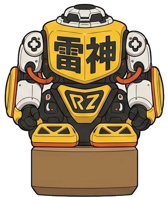

# RAIZIN DROP TOWER

<p align="center">
  
</p>

雷神を頭に乗せた **3Dだるま落とし**（試作）。

ハンマーで木製ブロックを横から叩き、**雷神を落とさないように下から1段ずつ抜いていく**ゲームです。
10段すべて抜いて雷神が倒れなければクリア。360度どこからでも狙えます。

ブラウザだけで動きます。Three.js + cannon-es + Vite。

## 遊ぶ

**https://non-light.github.io/raizin-drop-tower/**

ブラウザで開くだけです。インストールは要りません。

手元で動かす場合は次のとおり。

```bash
npm install
npm run dev
```

表示された `http://localhost:5173` を開きます。

| 操作 | 内容 |
| --- | --- |
| ブロックにカーソル | 光ったら叩ける |
| ブロックを左ボタンで押したまま | パワーゲージが 0% → 100% → 0% と往復する |
| ボタンを離す | **いま見ている方向から**ハンマーが振られ、ブロックはその向きへ抜ける |
| 何もない所を左ドラッグ／どこでも右ドラッグ | 視点を回す（360度・上下は床下と真上を除く範囲） |
| ホイール | ズーム |
| `C` キー | 視点をリセット |
| `R` キー | やり直し |
| `M` キー／右下のボタン | 音のオン・オフ |

ブロックの上で左ドラッグしても視点は動きません。叩く操作と視点操作がぶつからないよう、
**ブロックを掴んでいない左ドラッグ**と**右ドラッグ**だけをカメラに回しています。

カメラを回せば叩く方向も変わります。**背景の何かを狙って飛ばすこともできます。**

### ブロックの種類

毎ゲーム、3種類がランダムに混ざります。種類によって「ちょうどいい」パワーの位置が違うので、
選んだ瞬間にゲージの緑帯もそこへ動きます。

| 種類 | 見た目 | ちょうどいい帯 | 特徴 |
| --- | --- | --- | --- |
| NORMAL | ふつうの木 | 30〜72% | 基準 |
| HEAVY | 黒く重そう | 46〜90% | 強めに叩かないと抜けない |
| SLIPPERY | 白くつるつる | 20〜56% | 軽く叩くだけで抜ける。強いとすぐ危ない |

### 判定とコンボ

叩くたびに **WEAK / PERFECT / DANGER** が出ます。

| 判定 | 内容 |
| --- | --- |
| WEAK | 弱すぎ。少しズレるだけで抜けきらない。続けると塔が傾いて危ない |
| PERFECT | ブロックだけがスコーンと横へ抜け、上の段と雷神が自然に落ちて積み直る |
| DANGER | 強すぎ。ブロックが暴れて飛び出し、上の段と雷神も大きく揺れる |

PERFECT が続くと **コンボ**が伸びます。PERFECT 以外はその場でリセットです。
3 COMBO でカメラが軽く弾み、雷神がしゃべります。5 COMBO で雷神が跳ねます。

### 風

ときどき風が吹きます。**必ず先に予兆（`← WIND` / `WIND →`）が出る**ので、
そこで「待つ」か「かまわず叩く」かを選べます。

- **BREEZE** … 塔と雷神が少し揺れる程度
- **STRONG WIND** … かなり揺れる。この最中に強く叩くと崩れやすい

風だけでは倒れない強さにしてあります（実測で確認済み）。危ないのは操作と重なったときです。

### 終わりかた

- **GAME OVER** … 雷神が倒れた／落ちた／地面まで落ちた、または塔が崩れた
- **RAIZIN CLEAR!** … 最後の1段を PERFECT で抜くと、専用の演出が入ります
  （スロー → スコーン → 着地 → ひと呼吸 → 雷 → タイトル → ミッション結果）
- **CLEAR！** … 最後の1段が DANGER で飛んでいった場合など

どちらも「もう一度」ボタンで最初からやり直せます。

## ミッション

ゲーム開始時に2つランダムで出ます。**クリアの条件ではありません。**
達成しなくてもクリアできますし、達成してもゲームは続きます。

HARD が2つ同時に出ることはなく、HARD が入ったら相方は EASY になります。
`3 COMBO` と `5 COMBO` のような上位互換の組み合わせも出ません。
リスタートのたびに選び直し、直前とまったく同じ組み合わせは避けます。

| 難易度 | ミッション |
| --- | --- |
| EASY | PERFECTを3回成功させる／HEAVYをPERFECTで抜く／SLIPPERYをPERFECTで抜く／鐘を鳴らす |
| NORMAL | 3 COMBOを達成する／空き缶を3個倒す／隠し扉を開ける |
| HARD | 5 COMBOを達成する／GOLDEN PERFECTを成功させる |

## 背景ギミック

塔のまわりに **鐘・空き缶・木箱** が置いてあります。飛ばしたブロックが当たると、
鳴ったり転がったり倒れたりします。クリアには一切関係しない遊び要素です。

そして、よく見ると**もう1つ何か**置いてあります。

## 雷神の画像を差し替える

`assets/raizin_daruma.png` が元の設定シート（正面・左側面・右側面・背面が横に並んだ1枚）です。
ここから4方向を切り出して使っています。

```bash
python3 tools/slice_raizin.py assets/raizin_daruma.png
```

`assets/raizin_daruma_{front,left,right,back}.png` が作り直されます。
シートを差し替えたら、このコマンドを実行するだけで反映されます（`npm run dev` は再起動不要）。

切り出しスクリプトがやっていること。

- 背景（薄いグレー）は色指定ではなく**外周からの塗りつぶし**で抜いています。
  色で抜くと、ロボットの白いパーツまで一緒に消えてしまうためです。
- 抜いたあと、透明部分の色をまわりの色でにじませています。
  元の背景色が残っていると、縮小したときに輪郭へ白いふちが出ます。
- **土台（茶色）の左右中心と底**を基準点にして、4枚をまったく同じ大きさのキャンバスへ貼り直します。
  これがあるので、向きが切り替わってもサイズが跳ねたり左右にずれたりしません。

## 調整のしかた

数値はすべて [`src/config.js`](src/config.js) にまとまっています。
遊んでみて気になったところは、基本このファイルだけ触れば変わります。

| やりたいこと | 触る場所 |
| --- | --- |
| 全体をもっと重くしたい | `physics.gravity` を小さく（例 `-14`） |
| ブロックが抜けやすすぎる | `hit.weakMax` を上げる／`hit.slideTime` を短く |
| もっと勢いよく飛ばしたい | `hit.speedMax` を上げる |
| 段数を変えたい | `block.count`（**下の注意も読んでください**） |
| 雷神が倒れやすい／倒れにくい | `raizin.comDrop`（大きいほど倒れにくい）、`raizin.fallTiltDeg` |
| 雷神の大きさ | `raizin.height`（当たり判定は `bodyWidth` / `bodyDepth`） |
| 雷神をもっと揺らしたい | `hit.shakeAbove` / `hit.shakeHeight` を上げる |
| 衝撃を塔の上まで伝えたい | `hit.shockFalloff` を下げる（`0` で減衰なし） |
| 毎回同じ動きになるのが気になる | `hit.jitter` を上げる（`0` にすると完全に同じ動きになる） |
| 左右の絵が逆に見える | `raizin.flipSides` を `true` に |
| 向きの切り替わりがパタパタする | `raizin.switchHysteresisDeg` を上げる |
| ハンマーの振りを速く／遅く | `hammer.windUp` / `hammer.swing` |
| ハンマーが正面すぎて塔に重なる | `hammer.sideOffset`（横へずらす角度） |
| ゲージの往復を速く | `hit.chargeCycle` を短く |
| カメラの初期位置・回転量・ズーム範囲 | `camera.*` |
| ブロックの種類ごとの難易度 | `blockTypes.*.weakMax` / `goodMax` / `speedScale` |
| 種類ごとの出る数 | `blockTypes.*.count`（合計が `block.count` を超えたぶんは切り捨て） |
| 風の強さ・頻度 | `wind.breezeAccel` / `strongAccel` / `chancePerTurn` / `minTurnsBetween` |
| 風の予兆をもっと長く | `wind.telegraph` |
| コンボ演出の出はじめ | `combo.bounceFrom` / `cheerFrom` / `hopFrom` |
| 背景ギミックの位置 | `props.*`（鐘・缶・木箱） |
| 鍵と扉と金ブロックの位置 | `bonus.key.at` / `bonus.door.at` / `bonus.gold.at` |
| 金ブロックの難しさ | `bonus.gold.type.weakMax` / `goodMax` |
| クリア演出の尺 | `finale.slowTime` / `pause` / `thunderTime` / `missionDelay` |
| 音量 | `audio.volume` |

ブラウザのコンソールから `window.game` でゲーム本体に触れます（`window.game.cfg` が上の設定）。

### 段数を増やすときの注意

**塔の高さ ÷ 幅がだいたい 2 を超えると、遊べないくらい崩れやすくなります。**

ブロックを抜くたびに上の段が1段ぶん落ちるので、そのたびに塔がわずかに傾きます。
細長い塔ではこの傾きが毎回積み上がり、どんなに上手く叩いても4〜5手で必ず倒れます。
実測でも、高さ÷幅が 3.0 だとまともな一撃でも 0〜1割しかクリアできず、
1.9 まで下げると全パワー帯で安定してクリアできました。

現在は 10段 × 高さ0.5 ＝ 5.0 に対して幅 2.6（比 約1.9）にしてあります。
段数を増やすときは `block.width` / `block.depth` も一緒に広げてください。

## 仕組みのメモ

### ブロックだけが「スコーン」と抜ける

だるま落としで一番むずかしいのは、**叩いたブロックだけが抜けて、上は巻き込まれずに落ちる**挙動です。
素の物理演算だけでやると、上に乗った重量ぶんの摩擦と、落ちてくる上の段の角への引っかかりで、
ブロックが途中で止まってしまいます（摩擦係数を 0.02 まで下げても、荷重に負けて 0.5 ほどで停止しました）。

そこで叩いた瞬間だけ、

1. そのブロックの摩擦をゼロにする（`slip` マテリアルへ差し替え）
2. `hit.slideTime` の間だけ、横向きの速度が落ちないよう毎サブステップで保証する

という2つをやっています（[`src/game.js`](src/game.js) の `applyHit` と `keepSliding`）。
時間が切れたらふつうの木材に戻るので、抜けたあとは自然に減速して転がります。
「弱すぎ」のときはこの保証時間がごく短い（`hit.weakSlideTime`）ので、少し動いただけで荷重に負けて止まります。

### 雷神が持ちこたえる

当たり判定の箱を重心より上にずらして置いてあります（`raizin.comDrop`）。
重心が足元近くにある起き上がりこぼしと同じ状態なので、多少揺れても戻ってきます。
ちょうどいい一撃だと 30〜45度ほど傾いてから立ち直ります。

### 向きの切り替え

物理オブジェクトは**1つのまま**で、見た目の板だけをカメラの方向に合わせて4枚から選んでいます
（[`src/raizin.js`](src/raizin.js)）。

- 板はカメラの方を向くよう、**雷神のローカル座標系の中で**Y軸だけ回しています。
  こうすると、物理側が持っている傾きはそのまま残ります。
- どの絵を出すかは、雷神から見たカメラの角度で決めます。境目では
  `raizin.switchHysteresisDeg` ぶん行き過ぎてから切り替えるので、揺れている最中にパタパタしません。
- 4枚は同じ大きさ・同じ基準点に揃えてあるので、板の大きさも位置も切り替え時に一切変わりません。

### 360度どこからでも叩く

叩く向きは「カメラ → 選んだブロック」の水平方向です。ハンマーはその手前に立ち、
その向きへ振り込むので、ブロックはカメラから見て奥へ抜けていきます。

ハンマーの支点は **腕の長さ ＋ ブロック表面までの距離 ＋ ヘッドの厚みの半分 ＋ すき間**
だけ外側に置いてあります。腕の仰角が 0 のときがいちばんブロックへ近づく姿勢で、
そこがちょうど表面です。実測でも、どの角度から振ってもヘッドの面は表面の 0.06 手前で止まります
（斜めから振ると表面までの距離は 1.30 → 1.84 と変わりますが、支点もそのぶん下がります）。

振り抜きは仰角をマイナスにするだけなので、ヘッドは下へ抜けていき、ブロックの中へは進みません。
衝撃を与えるのは、見た目のハンマーがブロックへ当たった瞬間です。
ハンマー自体は物理オブジェクトではありません（そのほうがめり込みも取りこぼしもなく安定します）。

真正面から振るとハンマーがカメラとブロックのちょうど間に来て、塔に突き刺さって見えます。
そこで **叩く向きごと 0.55rad（約31度）横へずらして**います。向き自体をずらしているので、
「ハンマーが来た方向とは反対側へ飛ぶ」という関係は崩れません。

### 雷神の当たり判定が正方形な理由

見た目は板1枚で、つねにカメラのほうを向きます。そのため当たり判定を板と同じ形
（幅1.7 × 奥行き1.15）にしていたころは、**奥へ押されたときだけ極端に倒れやすい**状態でした。
360度から叩けるようになった結果、叩く方向によって難易度が変わってしまったので、
当たり判定は 1.7 × 1.7 の正方形にしてあります。

### 隠しボーナス

鍵にブロックが当たると扉が開き、金のブロックが出ます（1ゲームに1回）。
金のブロックは通常の塔とは別扱いで、**クリア条件には一切関係しません**。
出さなくてもクリアできますし、出したまま放っておいてもクリアできます。

金のブロックは緑帯が狭く（40〜62%）、成功すると `GOLDEN PERFECT!` と、
**次の1回だけコンボが切れない** `COMBO GUARD ×1` がもらえます。
失敗してもゲームオーバーにはならず、転がっても台座へ戻ってくるので何度でも挑戦できます。

### 効果音

音声ファイルは持たず、その場で合成しています（仮SE）。
[`src/sfx.js`](src/sfx.js) の `SOURCES` が音の一覧で、各エントリに `file` を書けば
そちらが優先で再生されます。呼び出し側は `playPerfect()` のような名前しか知らないので、
差し替えはこのファイルだけで完結します。
同じ音が機械的に聞こえないよう、鳴らすたびに高さ・長さ・音量を少しだけ振っています。

### ちらつきについて

段の境目は、以前は少し大きい箱を重ねて出していましたが、その箱の天面がブロックの天面と
**完全に同じ高さ**にあり、z-fighting でちらついていました。
いまは境目をテクスチャの上下に焼き込んでいるので、面が重なるところがありません
（[`src/textures.js`](src/textures.js) の `makeWoodSideTexture`）。

床と台も、以前は 0.03 しか離れておらず遠景で干渉していたので、床を下げて離してあります。

静止したブロックは cannon-es 側で完全に眠るため、描画位置は 1e-6 も動きません。

## ファイル構成

```
index.html
assets/
  raizin_daruma.png            元の設定シート（差し替えるならここ）
  raizin_daruma_front.png      ここから下の4枚は tools/slice_raizin.py が生成する
  raizin_daruma_left.png
  raizin_daruma_right.png
  raizin_daruma_back.png
tools/
  slice_raizin.py              シートから4方向を切り出す
src/
  main.js             起動
  config.js           調整値ぜんぶ
  game.js             ゲーム進行・入力・勝敗判定・クリア演出
  scene.js            ライト・床・台
  orbitcam.js         360度カメラ
  physics.js          物理ワールドと摩擦の組み合わせ
  tower.js            ブロックと雷神の生成
  raizin.js           雷神の見た目（4方向の切り替え）
  hammer.js           ハンマーと振りのアニメーション
  wind.js             風イベント
  props.js            背景ギミック（鐘・空き缶・木箱）
  bonus.js            隠しボーナス（鍵・扉・金のブロック）
  missions.js         ミッションの抽選と進捗
  finale.js           クリア時の雷
  sfx.js              効果音（ここだけ差し替えれば音声ファイルにできる）
  ui.js               ゲージ・判定・ミッション・結果表示
  textures.js         木目テクスチャの生成
  style.css
```

## まだやっていないこと

演出・エフェクト・音は入れていません。まず「だるま落としとして気持ちよく遊べるか」を確かめる版です。
